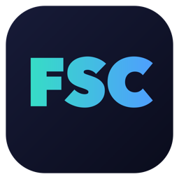

<p align="center">
  
</p>

<h1 align="center">Freesound Connect for DaVinci Resolve</h1>

A standalone desktop app: search [freesound.org](https://freesound.org),
preview sounds with an interactive waveform, and **drag them — or a trimmed
region — straight onto your DaVinci Resolve timeline**.

- 🔎 Full-text search with license/sort filters and rich detail (format,
  sample rate, rating, downloads, tags)
- ▶️ Interactive **waveform** preview: play/pause, click-to-seek, volume
- ✂️ **Drag across the waveform** to select a region and insert only that part
- 🎬 Drag a result — or the player's **Drag to timeline** handle — onto
  Resolve's timeline or Media Pool; it lands as a real, **original-quality**
  audio file
- ♥ **Shotlist**: favourite sounds with the heart on any row, review them in
  the side drawer, and save them as named **playlists**
- 🔥 **Trending** sounds on launch, before you even search
- 🔐 One-click **"Log in with Freesound"** (OAuth2) for original-quality
  downloads
- 📝 Auto-maintains a `CREDITS.txt` attribution file for the Creative Commons
  sounds you use
- 🆓 Works with **both the free version of DaVinci Resolve and Studio**
  (macOS, Windows, Linux) — it uses plain OS drag-and-drop, not Resolve's
  Studio-only scripting APIs

Built with **Electron + Angular**. The app lives in [`app/`](app/); see
[app/README.md](app/README.md) for architecture and full developer docs.

## Why a standalone app?

Blackmagic removed script GUIs from the free version of Resolve in 19.1, and
external scripting has always been Studio-only. OS drag-and-drop works in every
version — so Freesound Connect runs as its own window next to Resolve and hands
files over the same way Finder/Explorer does.

## Run from source

Requires Node 22.12+ / 24.15+. From the repo root:

```bash
cd app
npm install
npm run dev        # ng serve + Electron with live reload
```

Running from source needs OAuth credentials — set `FREESOUND_CLIENT_ID` /
`FREESOUND_CLIENT_SECRET`, or copy `app/electron/credentials.example.json` to
`app/electron/credentials.json` (gitignored) and fill in the values. See
[Setting up OAuth credentials](#setting-up-oauth-credentials-for-maintainers).

## Build installers

```bash
cd app
npm run dist       # electron-builder → app/release/
```

Produces a dmg/zip (macOS), nsis installer (Windows), and AppImage (Linux). CI
([.github/workflows/electron-build.yml](.github/workflows/electron-build.yml))
builds all three on a `v*` tag and attaches them to a GitHub Release.

## Usage

1. Launch the app and keep it next to (or on top of) Resolve.
2. Click **Log in with Freesound** and approve access in the browser.
3. Type a search term, or browse the trending list shown on launch. Filter by
   license (CC0 / CC-BY / CC-BY-NC) and sort order.
4. Click a result to load its **waveform**; click the waveform to seek, or
   double-click a row to play.
5. **Drag the row (or the player's "Drag to timeline" handle) onto your Resolve
   timeline** — it downloads and drops the original-quality file.
6. To insert only part of a long sound, **drag across the waveform** to select
   a region; the **Drag to timeline** handle then inserts just that region as a
   WAV.
7. Tap the **♥** on any row to add it to your **Shotlist** (the drawer at top
   right). Save the shotlist as a named **playlist**, browsable from the
   Playlists page.

Sounds are saved to `~/Documents/FreesoundConnect/`; keep that folder, since
your Resolve project links to the files in it. Every sound you take is logged
to `CREDITS.txt` there with its author, URL, and license.

## Logging in

Freesound Connect signs you in with your real Freesound account via OAuth2 —
no API key to paste. Tokens are stored locally in
`~/.freesoundconnect/config.json` and refreshed automatically. Click **Log out**
to revoke local access (this doesn't revoke the authorization on freesound.org
itself, which you can do from your
[Freesound account settings](https://freesound.org/home/app_permissions/)).

If the browser redirect can't reach `127.0.0.1:8918` (strict firewall/proxy),
the login window lets you paste the authorization code by hand.

## Data & files

Under `~/.freesoundconnect/`: `config.json` (OAuth tokens), `playlists.json`
(shotlist + playlists), and `previews/` (cached preview MP3s). Downloads and
`CREDITS.txt` go to `~/Documents/FreesoundConnect/`.

## Setting up OAuth credentials (for maintainers)

Freesound Connect uses a single shared "Log in with Freesound" OAuth2 app; end
users never register anything. To build it yourself you need your own Freesound
app credentials:

1. Log in at [freesound.org](https://freesound.org) and go to
   <https://freesound.org/apiv2/apps/> to create an API credential.
2. Set its **Redirect URI** to exactly `http://127.0.0.1:8918/callback`
   (must match `REDIRECT_URI` in [app/electron/oauth.ts](app/electron/oauth.ts)).
3. Copy `app/electron/credentials.example.json` to
   `app/electron/credentials.json` (gitignored) and fill in the
   `clientId` / `clientSecret`.

For CI-built releases, add `FREESOUND_CLIENT_ID` and `FREESOUND_CLIENT_SECRET`
as repository secrets — the build workflow writes them into
`credentials.json` before packaging.

## License

[MIT](LICENSE). Not affiliated with Blackmagic Design or the Freesound project.
Sound content is subject to each sound's own Creative Commons license and the
[Freesound API terms](https://freesound.org/help/tos_api/).
